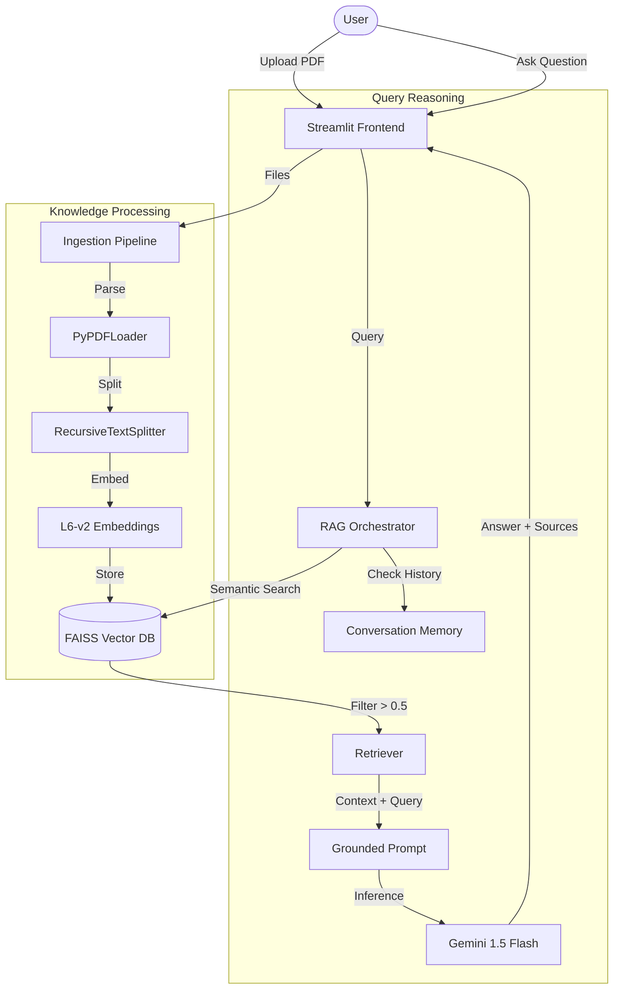

# 🤖 AI Prototyping Engineer: Chat with PDFs

A production-grade AI prototype that enables users to have interactive conversations with multiple PDF documents simultaneously. This system leverages **Retrieval-Augmented Generation (RAG)** to provide grounded, accurate answers while strictly minimizing hallucinations.

---

## 🚀 Features (TASK 1: LLM-Powered AI Prototype)

- **Multi-Document Reasoning**: Upload multiple PDFs at once and ask questions across all of them.
- **RAG Pipeline**:
    - **LLM**: `Gemini 1.5 Flash` via Google AI Studio (Free tier).
    - **Embeddings**: `sentence-transformers/all-MiniLM-L6-v2` (Running locally for speed and privacy).
    - **Vector Database**: `FAISS` for high-performance semantic search.
- **Chunking Strategy**: Uses `RecursiveCharacterTextSplitter` (1000 character chunks with 100 character overlap) to maintain semantic context.
- **Modern UI**: Clean, interactive chat interface built with **Streamlit**.

## 🛡️ Hallucination & Quality Control (TASK 2)

To ensure high-quality and truthful responses, the following guardrails are implemented:

1.  **Strict Similarity Threshold (0.5)**: The retriever only pulls document chunks with a cosine similarity score of at least **0.5**. If no relevant context is found, the system refrains from answering.
2.  **Source-Grounded Prompt Engineering**: The LLM is forced to follow a strict system prompt:
    > *"If the answer is not in the context, say 'I do not have enough information to answer this based on the provided documents.' and do not try to make up an answer."*
3.  **Source Transparency**: Every response includes an expandable section showing the exact snippets of text (and page numbers) used by the AI to verify the answer.

## 🔄 Rapid Iteration & Memory (TASK 3)

### Conversational Memory
The prototype implements **Conversational Memory** using `ConversationBufferMemory`. This allows for natural follow-up questions like *"Can you explain that point further?"* without re-stating the context.

- **Choice Rationale**: Chosen to provide a "chatbot" feel rather than a "search engine" feel.
- **Trade-offs**:
    - **Pros**: Maintains history for better user experience.
    - **Cons**: Large history consumes tokens. However, Gemini 1.5 Flash has a massive 1M+ token context window, making this less of an issue than with smaller models.
- **Limitations**: In an enterprise production environment, we would use `ConversationSummaryBufferMemory` to condense old conversations and save on token costs.

## 🏗️ System Architecture (TASK 4)



### Design Decisions
- **Vector DB**: FAISS chosen for being lightweight and local, ideal for rapid prototyping without external database setup.
- **LLM Orchestration**: LangChain provides the glue for memory, retrieval, and generation.
- **Cost Control**: Local embeddings + Google AI Studio Free Tier ensures $0 operational cost for development.

---

## 🛠️ Setup & Execution

### 1. Prerequisites
- Python 3.10+
- Google AI Studio API Key ([Get it here](https://aistudio.google.com/))

### 2. Installation
Clone the repo and set up a virtual environment:
```powershell
python -m venv .venv
.venv\Scripts\Activate.ps1   # Windows
# source .venv/bin/activate  # Mac/Linux

pip install -r requirements.txt
```

### 3. Configuration
Create a `.env` file in the root directory:
```env
GOOGLE_API_KEY=your_gemini_api_key_here
```

### 4. Running the App
```powershell
streamlit run app.py
```

---
*Created as part of the AI Prototyping Engineer Practical Assessment.*
